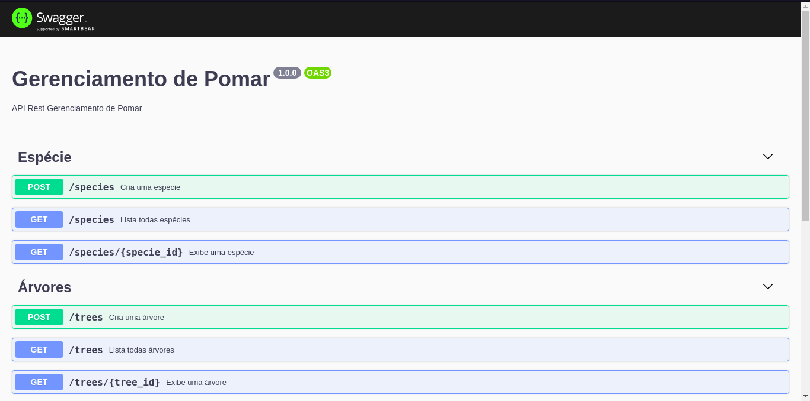

<h1 align="center">
 Gerenciamento de Pomar (API Backend)
</h1>

<p align="center">
  <a href="#objetivo">Objetivo</a>&nbsp;&nbsp;&nbsp;|&nbsp;&nbsp;&nbsp;
  <a href="#tecnologias">Tecnologias</a>&nbsp;&nbsp;&nbsp;|&nbsp;&nbsp;&nbsp;
  <a href="#instruções">Instruções</a>&nbsp;&nbsp;|&nbsp;&nbsp;&nbsp;
  <a href="#Documentação">Documentação</a>&nbsp;&nbsp;
</p>

## :bookmark: Objetivo

API RESTful para gerenciamento de pomar de um produtor de frutas.

## :rocket: Tecnologias

Tecnologias utilizadas para desenvolver a API

- [Node.js](https://nodejs.org/en/)
- [TypeScript](https://www.typescriptlang.org/)
- [Express](https://expressjs.com/pt-br/)
- [TypeORM](https://typeorm.io/#/)
- [uuid v4](https://github.com/thenativeweb/uuidv4/)
- [PostgreSQL](https://www.postgresql.org/)
- [Jest](https://jestjs.io/)
- [Eslint](https://eslint.org/)
- [Prettier](https://prettier.io/)
- [EditorConfig](https://editorconfig.org/)
- [class-transformer](https://github.com/typestack/class-transformer#readme)

## :bookmark: Instruções

### Requisitos

- [Node.js](https://nodejs.org/en/)
- [Yarn](https://classic.yarnpkg.com/) ou [npm](https://www.npmjs.com/)
- Uma instância do [PostgreSQL](https://www.postgresql.org/)

> Obs.: Eu recomendo utilizar docker

```bash
$ git clone https://github.com/matheusrdelima/gerenciamento-pomar.git && cd gerenciamento-pomar
```
**Siga os passos abaixo**

```bash
# Instale as dependências
$ yarn

# Crie a instância do postgreSQL utilizando docker
$ docker run --name orchard -e POSTGRES_DB=orchard -e POSTGRES_PASSWORD=docker -p 5432:5432 -d postgres

# Assim que o serviço estiver em execução, execute as migrações
$ yarn typeorm migration:run

# Para iniciar a API
$ yarn dev

# Para executar os testes
$ yarn test
```
## :bookmark: Documentação

Após a instalação e execução do servidor a url http://localhost:3333/doc exibirá a documentação da API mostrando as rotas disponíveis.


